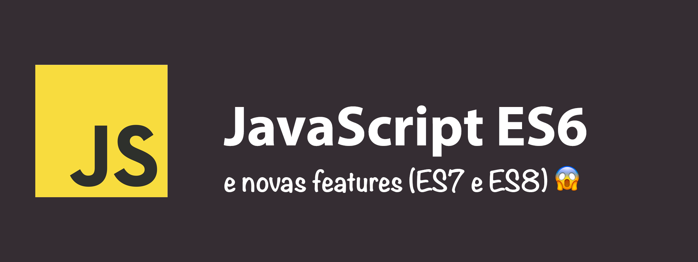
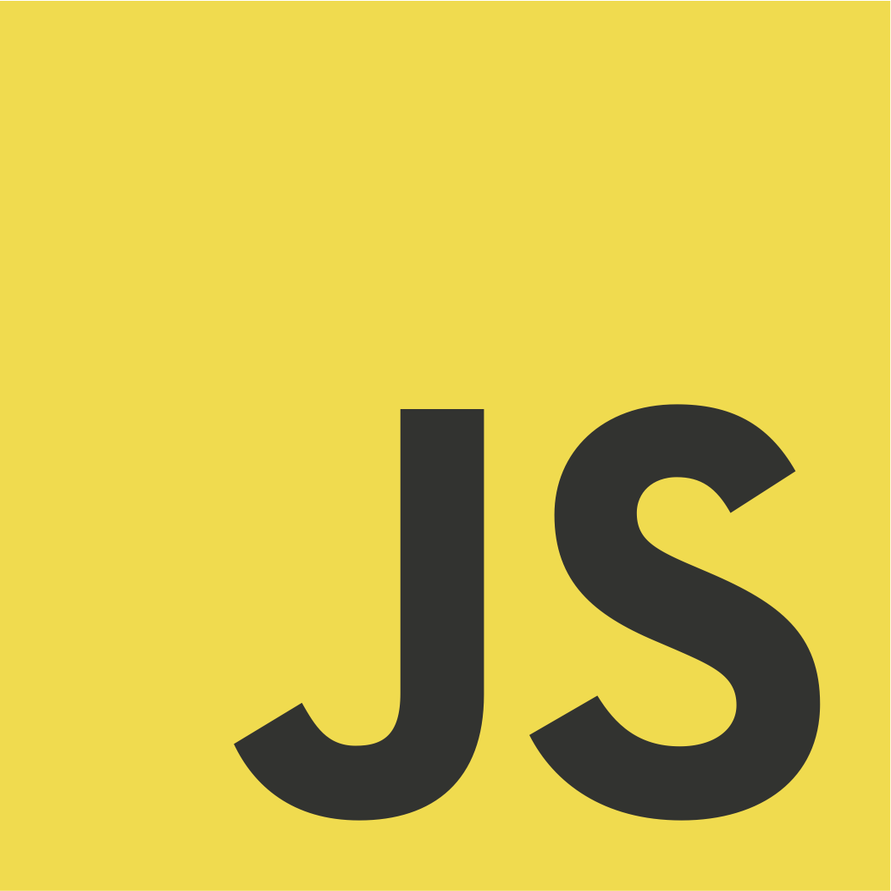

# Ebook JavaScript ES6, ES7 + ES8 

O livro visa compartilhar o conhecimento sobre JavaScript e suas novas  features da ES6, ES7 + ES8 no formato de guia rápido para buscas rápidas.

  

# Como contribuir

Você pode contribuir com conhecimentos sobre Javascript ES6. Sinta-se à vontade para escrever e adicioná-lo em alguns passos:

- Escreva uma breve descrição sobre o tópico.
- Por favor, inclua um arquivo .png para a capa: menos de 100Kb no formato 1902x720.
- Escreva o máximo de exemplo possível.
- Defina o nome da sua publicação da seguinte forma Ex. `es6-map.md`, Ex2. `es7-includes.md`.
- Faça um pull request

Obrigado adiantado!

# Indice

### JavaScript ES6, ES7 + ES8

- [ Reduce ](es6-reduce.md)