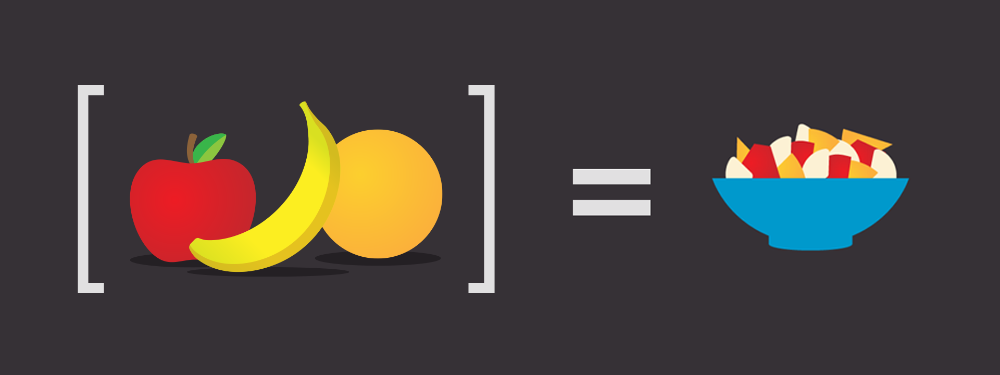

### [Retornar para o índice](README.md)



# ES6 - Reduce

A nova versão do __Javascript ES6__ veio com várias features novas e uma das mais legais é o [.reduce()](https://developer.mozilla.org/en-US/docs/Web/JavaScript/Reference/Global_Objects/Array/Reduce). A função reduce aplicar uma lógica em um conjunto (array) de objetos e reduz esse conjunto em um único objeto. ```[🍎, 🍐, 🍏, 🍇, 🍓, 🍍, 🥝, 🍅, 🥦, 🥕 ].reduce(callback, 🍆) = 🥗 ```

### Reduce é uma função high-order

 A função reduce é considerada high-order porque recebe uma função de callback como parametro.

### Estrutura básica de um reduce.

```javascript 
    .reduce(callback, valueDefault)
```

A função reduce tem dois parametros:

* __callback__ 

> O primeiro parametro é uma função de callback.

* __valueDefault__

> O segundo é um valor default, esse segundo paramentro não é obrigatório. `Opcional`

* A callback tem 4 (quatros) parametros
    * accumulator
    * currentValue
    * currentIndex `Opcional`
    * array `Opcional`


Agora vamos ver alguns exemplos para enteder melhor como o `.reduce()` funciona.

#### EX01 - Pegar o maior valor

```javascript
    const numbers = [101, 2, 5, 100, 90]

    const reducer = (max, currentValue) => max < currentValue ? currentValue : max

    const maxValue = mumbers.reduce(reducer, 0)

    // O retorne será:  101
```

#### EX02 - Total da conta

```javascript
    const conta = [
        {
            descricao: 'Cerveja erdinger', 
            valor: 22.00,
            quantidade: 3
        },
        {
            descricao: 'Coca-cola', 
            valor: 8.00,
            quantidade: 1
        },
        {
            descricao: 'Carne de Sol', 
            valor: 45.00,
            quantidade: 1
        }
    ]

    const reducer = (accumulator, currentValue) => accumulator + (currentValu.valor * currentValu.quantidade)


    const valorConta = conta.reduce(reducer, 0)

    // O total da conta é:  R$ 119.00
```

#### EX03 - Sorvetes mais tomados

```javascript
    const data = [
     { name: 'Carlos', favoriteIceCreams: ['Strawberry', 'Vanilla', 'Chocolate', 'Cookies & Cream'] },
     { name: 'Ricardo', favoriteIceCreams: ['Cookies & Cream', 'Mint Chocolate Chip', 'Chocolate', 'Vanilla']},
     { name: 'Amanda', favoriteIceCreams: ['Chocolate', 'Rocky Road', 'Pistachio', 'Banana'] },
     { name: 'André', favoriteIceCreams: ['Vanilla', 'Chocolate', 'Mint Chocolate Chip'] },
     { name: 'David', favoriteIceCreams: ['Vanilla', 'French Vanilla', 'Vanilla Bean', 'Strawberry'] },
     { name: 'Ruan', favoriteIceCreams: ['Strawberry', 'Chocolate', 'Mint Chocolate Chip'] }
 ];

  const redurer = (accumulator, currentValue) => {
      let IceCreams = accumulator

      currentValue.favoriteIceCreams.map(IceCream => {
          IceCreams[IceCream] = IceCreams.hasOwnProperty(IceCream) ? accumulator[IceCream] + 1 : 1
      })

      return Object.assign(accumulator, IceCreams)
  }

   const sorvetes = data.reduce(redurer, {})

   /*
     { 
        'Strawberry': 3,
        'Vanilla': 4,
        'Chocolate': 5,
        'Cookies & Cream': 2,
        'Mint Chocolate Chip': 3,
        'Rocky Road': 1,
        'Pistachio': 1,
        'Banana': 1,
        'French Vanilla': 1,
        'Vanilla Bean': 1 
    }
  */
```


